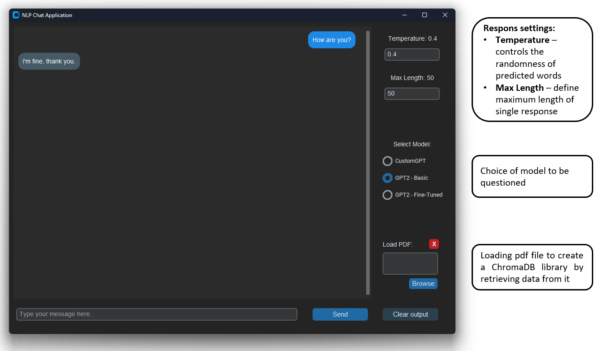

# GPT Chatbot with PDF Question Answering

## Overview

This project implements a conversational AI system using both custom-built and pre-trained GPT models. It features:

- A custom Transformer-based GPT model trained from scratch on WikiText-103
- Fine-tuning on SQuAD 2.0 for question answering
- Integration of HuggingFace's GPT-2 Large with PDF processing via LangChain
- A GUI application for interactive chatting with model switching capabilities
- Retrieving data from a selected PDF file to obtain the knowledge contained in it

---

## Setup Instruction

To run the application you must use python 3.9 and install all dependencies:
```python
pip install -r requirements.txt
```

---

##  Technical Stack
| Component | Technologies Used |
| :-----: | :---: |
| Core Models | PyTorch, Transformers |
| Custom GPT | Transformer architecture with 6 layers, 8 heads |
| Pre-trained GPT | GPT2-Large from HuggingFace |
| Fine-Tuning | LoRA (Low-Rank Adaptation) for efficient tuning |
| CUDA | Torch 2.2.0 + CUDA 12.1 |
| PDF Processing | LangChain, PyPDF, ChromaDB |
| GUI | CustomTkinter |
| Optimization | Gradient Accumulation, OneCycleLR |

---

##  Hardware

- **CPU:** AMD Ryzen 5 7600
- **GPU:** NVIDIA RTX 2080 Ti 11GB
- **RAM:** 32GB

---

##  Training time

- **Training custom GPT model -** 32 hours on WikiText-103 dataset
- **Fine-Tuning custom GPT model -** 21 hours on SQUAD 2.0 dataset
- **Fine-Tuning GPT-2 Large model -** 45 hours on SQUAD 2.0 dataset using LoRA

---

##  Chat App overview



---

## 🛠 Custom GPT Model Architecture

Implemented using Torch `nn.Transformer`:

```python
class GPT(nn.Module):
    def __init__(self, vocab_size, embedding_dim, num_heads, num_layers, block_size, dropout):
        super().__init__()
        self.embedding = nn.Embedding(vocab_size, embedding_dim, padding_idx=PAD_IDX)
        self.positional_encoding = nn.Parameter(torch.zeros(1, block_size, embedding_dim))
        self.transformer = nn.Transformer(
            d_model=embedding_dim,
            nhead=num_heads,
            num_encoder_layers=num_layers,
            num_decoder_layers=num_layers,
            dim_feedforward=4 * embedding_dim,
            dropout=dropout,
        )
        self.norm = nn.LayerNorm(embedding_dim)
        self.fc_out = nn.Linear(embedding_dim, vocab_size)

        # Initialize weights after creating all layers
        self.init_weights()

    def init_weights(self):
        # Initialize weights for model layers
        for name, module in self.named_modules():
            if isinstance(module, nn.Linear):
                nn.init.xavier_uniform_(module.weight)
                if module.bias is not None:
                    nn.init.constant_(module.bias, 0)
            elif isinstance(module, nn.Embedding):
                nn.init.normal_(module.weight, mean=0, std=0.02)

    def forward(self, src, tgt, src_mask=None, tgt_mask=None, memory_mask=None):
        # Dynamic positions
        positional_encoding = generate_positional_encoding(src.size(1), self.embedding.embedding_dim, src.device)
        src_emb = self.embedding(src) + positional_encoding
        tgt_emb = self.embedding(tgt) + positional_encoding[:, :tgt.size(1), :]

        src_emb = self.norm(src_emb)
        tgt_emb = self.norm(tgt_emb)

        transformer_output = self.transformer(
            src_emb.transpose(0, 1), tgt_emb.transpose(0, 1), src_mask, tgt_mask, memory_mask
        )

        logits = self.fc_out(transformer_output.transpose(0, 1))
        return logits
```

## 🛠 GPT-2 Large Fine-Tuning implementation

#### LoRA config
```python
model = GPT2LMHeadModel.from_pretrained(FINETUNED_GPT2_LARGE_PATH, device_map="auto")

peft_config = LoraConfig(
    r=16,  # LoRA hidden dimension
    lora_alpha=32,
    lora_dropout=0.1,
    bias="none",
    task_type="CAUSAL_LM"  # GPT-2 is an autoregressive model
)
model = get_peft_model(model, peft_config)
```

#### Data preprocessing
```python
def preprocess_data(example):
    context = example["context"]
    question = example["question"]
    answer = example["answers"]["text"][0] if example["answers"]["text"] else ""

    prompt = f"Question: {question}\nAnswer: {answer}"
    # Setting max context length by subtraction prompt length + 1 for spacing
    max_context_length = 200 - len(tokenizer(prompt)["input_ids"]) - 1  

    truncated_context = tokenizer.decode(tokenizer(context, truncation=True, max_length=max_context_length)["input_ids"],
                                                   skip_special_tokens=True)
    input_text = f"Context: {truncated_context}\n{prompt}"

    encoding = tokenizer(input_text, truncation=True, padding="max_length", max_length=EMBEDDING_DIM_SQAUD)

    return {
        "input_ids": encoding["input_ids"],
        "attention_mask": encoding["attention_mask"],
        "labels": encoding["input_ids"],
    }

# Tokenizing the dataset for each split separately
tokenized_dataset = {
    split: dataset[split].map(preprocess_data, remove_columns=["id", "title", "context", "question", "answers"])
    for split in ["train", "validation"]
}

# Data collator (token masking)
data_collator = DataCollatorForLanguageModeling(tokenizer=tokenizer, mlm=False)
```

#### Training settings
```python
training_args = TrainingArguments(
    output_dir=FINETUNED_GPT2_LARGE_SAVE_PATH,
    overwrite_output_dir=True,
    per_device_train_batch_size=4,  # Reduced batch size for 8GB VRAM
    per_device_eval_batch_size=4,
    gradient_accumulation_steps=4,  # Larger effective batch size
    evaluation_strategy="epoch",
    save_strategy="epoch", # Checkpoint after every epoch
    logging_strategy="steps",
    logging_steps=1,
    save_total_limit=4,
    learning_rate=3e-5,
    weight_decay=0.01,
    max_grad_norm=1,
    num_train_epochs=NUM_EPOCHS_LORA,
    warmup_steps=500,
    fp16=True,  # Using bfloat16 instead of fp16 - demands newer version of torch
    logging_dir="./logs",
    report_to="none",
    load_best_model_at_end=True,
)

# INITIALIZING THE TRAINER
trainer = Trainer(
    model=model,
    args=training_args,
    train_dataset=tokenized_dataset["train"],
    eval_dataset=tokenized_dataset["validation"],
    data_collator=data_collator,
    callbacks=[loss_logger],# Adding a callback to track time
)

trainer.train()
```

---

## 🛠 Langchain PDF handling 

#### File loading and text retrieving:
```python
def load_pdf(cls, pdf_path, chunk_size=500, chunk_overlap=100):
    if cls.chroma_loaded:
        print("Chroma database is already loaded. Skipping reloading.")
        return

    cls.clear_pdf()

    loader = PyPDFLoader(pdf_path)
    pages = loader.load()
    text_splitter = RecursiveCharacterTextSplitter(chunk_size=chunk_size, chunk_overlap=chunk_overlap)
    docs = text_splitter.split_documents(pages)

    embedding_model_name = "sentence-transformers/all-mpnet-base-v2"
    embeddings = HuggingFaceEmbeddings(model_name=embedding_model_name, model_kwargs={"device": DEVICE})

    vectordb = Chroma.from_documents(docs, embeddings, persist_directory="chroma_db")
    cls.retriever = vectordb.as_retriever()
    cls.chroma_loaded = True
```

#### Text generation:
```python
def generate_text_from_pdf(self, query, max_length=MAX_LENGTH, temperature=TEMPERATURE):
    if not BaseGPT2TextGenerator.retriever:
        raise ValueError("At first load PDF using load_pdf().")

    qa_prompt = PromptTemplate(
        input_variables=["context", "question"],
        template="\nUse the following context to answer the question concisely:\n{context}\nQuestion: {question}\nAnswer:"
    )

    # Get context from retriever
    context_docs = BaseGPT2TextGenerator.retriever.get_relevant_documents(query)
    context_texts = "\n".join([doc.page_content for doc in context_docs])

    # Create prompt (context + question)
    full_prompt = qa_prompt.format(context=context_texts, question=query)

    # Prompt tokenization
    input_ids = self.tokenizer(full_prompt, return_tensors="pt").input_ids.to(self.device)
    input_length = input_ids.shape[1]

    # Setting max answer length (input length + user max length | or max limit = 1024)
    max_length_with_input = min(input_length + max_length, INPUT_LIMIT)
    print("Input length: ", input_length)
    print("Max length: ", max_length_with_input)

    generator = self.get_generator(max_length_with_input, temperature)
    llm = HuggingFacePipeline(pipeline=generator)
    qa = RetrievalQA.from_chain_type(
        llm=llm,
        chain_type="stuff",
        retriever=BaseGPT2TextGenerator.retriever,
        verbose=True,
        return_source_documents=False,
        chain_type_kwargs={"prompt": qa_prompt}
    )

    result = qa.run(query)
```

---
